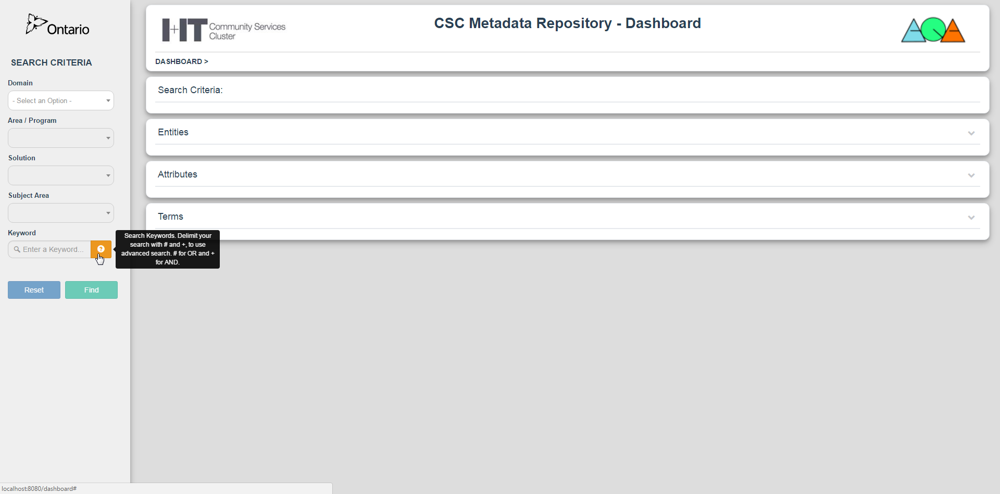
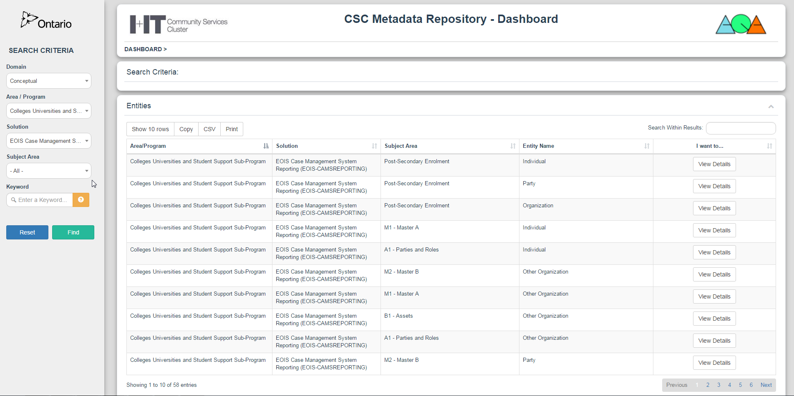
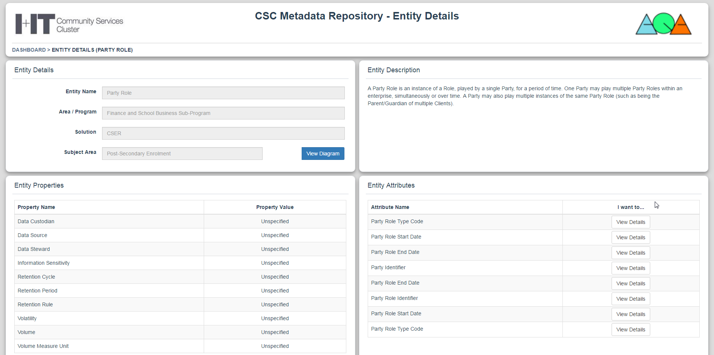
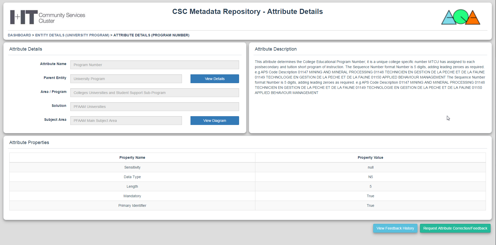

# ops-data-wiki
A full stack web application that I created from the ground up for the Ministry of Education. 
The site acts as a hub that allows users to parse through data hosted at the ministry according to various search criteria. 

